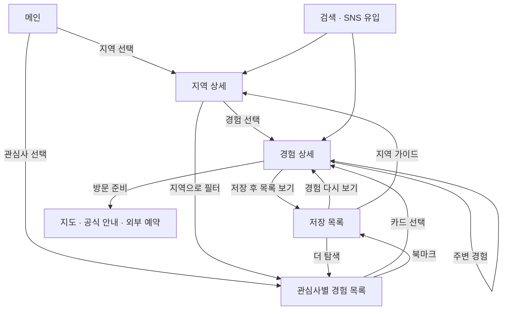
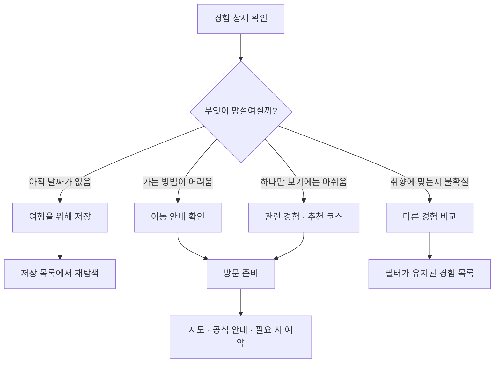

# Experience Korea — 초기 웹사이트 기획·사용자 흐름 인수인계 문서

작성일: 2026-09-22 · 수정일: 2026-09-23 · 버전: 1.1 · 문서 언어: 한국어 · 화면 시안 언어: 영어

## 0. 이 문서를 읽는 사람에게

이 문서는 「대한민국 관광산업 성장 사업」의 초기 웹사이트를 다른 대화, AI 도구, 기획자, 디자이너, 개발자가 앞선 대화 없이 이해하도록 정리한 기준 문서다. 현재 대화에서 합의한 방향과 제작된 다섯 종류의 이미지 시안을 바탕으로 한다. 원본 사업 문서 전체를 재검증한 보고서나 실제 여행 정보 조사 결과는 아니다.

현재 완료된 것은 **페이지 이미지 시안**이다. 웹사이트 코드, 실제 동작, 콘텐츠 검증, 배포가 완료된 상태가 아니다. 본 문서는 이미지를 첨부하지 않아도 구조를 이해할 수 있게 작성했다. 픽셀 수준으로 시안을 재현하려면 원본 이미지도 별도로 제공해야 한다.

문서의 상태 표기는 다음과 같다.

- **기준 방향:** 대화에서 정리했고 현재 다섯 페이지 시안이 따르는 방향.
- **구현 권고:** 화면 사이의 동작과 예외를 명확히 하기 위해 이 문서에서 구체화한 제안. 최종 확정 사항과 구분한다.
- **미정:** 조사 또는 사용자의 결정이 필요한 사항.

## 변경 이력

| 버전 | 날짜 | 변경 내용 | 영향받는 절 |
|---|---|---|---|
| 1.1 | 2026-09-23 | **선택 로그인과 저장 목록 동기화를 초기 범위에 추가.** 로그인은 선택 사항이며 이메일·비밀번호 방식 하나만 지원한다. 이메일 인증은 초기에 끈다. 로그인하지 않은 사용자는 기존처럼 이 기기에 저장하고, 로그인한 사용자의 저장 목록은 계정(Supabase)에 보관되어 다른 기기에서도 보인다. 콘텐츠·저장 데이터는 Supabase를 쓴다. 저장 단위는 여전히 ‘경험’이다. 세부 계획은 `docs/plan/supabase-migration-plan.md`. | §2.1, §9.3, §9.4, §11, §14, §15 |

이 표보다 아래 본문이 오래된 내용과 충돌하면 **이 표와 연결된 계획 문서가 우선**한다. 본문에는 해당 위치마다 `[v1.1 변경]` 표시를 달았다.

## 1. 사업 배경과 웹사이트의 목적

### 1.1 장기 비전

외국인이 다양한 한국의 지역·문화·일상을 경험하도록 돕고, 한국에 다시 방문하고 싶은 이유를 제공한다. 장기적으로 경험 데이터와 사용자 이해를 축적해 개인맞춤 여행 추천 및 AI 여행 코디네이터로 발전시키는 방향이다.

### 1.2 첫 웹사이트의 목적

> 한국 여행을 준비하는 외국인이 서울·부산·제주 외에도 자신의 취향에 맞는 지역과 경험을 발견하고, 실제 여행에서 해볼 경험을 선택하도록 돕는다.

핵심 사용자 흐름은 **가보고 싶다 → 내가 갈 수 있겠다 → 여행을 위해 저장하거나 방문을 준비한다**이다. 회원가입이나 예약 완료 자체가 초기 웹사이트의 유일한 목표는 아니다.

### 1.3 타깃과 검증 전제

- 한국을 처음 방문할 사람과 재방문을 고민하는 사람 모두를 고려한다.
- 유럽·미국·남미 여행자에게 우선 관심이 있으나, 국가별 우선순위나 취향은 아직 검증하지 않았다.
- 영어는 현재 시안의 공통 언어다. 최종 지원 언어와 번역 범위는 미정이다.
- 고객 문제 가설: “한국에 관심은 있지만 내 취향에 맞는 경험이 무엇인지, 실제로 갈 수 있는지 판단하기 어렵다.”
- 1인 운영을 고려해 제작·조사·갱신 가능한 범위로 시작한다. 매주 현장 취재를 해야만 유지되는 운영 방식에 의존하지 않는다.

### 1.4 시안 범위와 출시 범위의 구분

시안에는 강릉·전주·경주·순천이 등장한다. 이는 여러 지역으로 확장 가능한 화면 구조를 보여주는 예시이며, 네 지역을 모두 출시해야 한다는 확정 사항이 아니다. 강릉은 지역 상세와 경험 상세의 대표 예시다. 실제 출시 지역 수와 콘텐츠 수는 미정이며, 한 지역에서 탐색부터 방문 준비까지 완결하는 구성을 권고한다.

## 2. 초기 구현 범위

| 페이지 | 핵심 질문 | 역할 | 주요 다음 행동 |
|---|---|---|---|
| 메인 | 한국에서 무엇을 해볼까? | 지역과 관심사에 대한 호기심 형성 | 지역 상세 또는 경험 목록 |
| 지역 상세 | 이 지역을 여행에 넣을까? | 분위기·접근 방법·경험·코스 소개 | 경험 상세 또는 저장 |
| 관심사별 경험 목록 | 내 취향에 맞는 경험은 무엇일까? | 관심사와 조건으로 경험 비교 | 경험 상세 또는 저장 |
| 경험 상세 | 이 경험을 실제로 해볼까? | 매력·적합성·실행 가능성 판단 | 저장·방문 안내·관련 경험 |
| 저장 목록 | 가보고 싶었던 경험을 어떻게 다시 볼까? | 저장한 경험을 지역별로 재탐색 | 경험 상세·지역 가이드 |

### 2.1 초기 범위에 포함하지 않는 것

별도 Stories 목록·이야기 상세 페이지, AI 일정 생성, 자체 예약·결제, 후기 시스템, 자동 개인화 추천, 복잡한 지도 기반 일정 편집기는 현재 다섯 페이지 범위 밖이다. 향후 추가할 수 있으나 이번 범위의 필수 기능으로 간주하지 않는다.

> **[v1.1 변경]** v1.0에서 범위 밖이던 ‘회원 계정 및 기기 간 동기화’는 **선택 로그인(이메일·비밀번호)과 저장 목록 동기화**에 한해 초기 범위에 포함한다. 로그인 없이도 모든 기능을 쓸 수 있어야 하며, 프로필·알림·소셜 로그인은 여전히 범위 밖이다.

외부 공식 안내·지도·예약 링크와 직접 편집한 추천 코스는 초기 콘텐츠 안에 포함할 수 있다. 제휴 링크 등 수익모델은 별도 검토 대상으로, 제휴가 확보됐다고 가정하지 않는다.

### 2.2 기존 시안과 실제 MVP를 일치시키기 위한 구현 권고

기존 시안에 있는 메뉴·버튼을 전부 별도 페이지로 만들 필요는 없다.

| 시안 요소 | 초기 구현 권고 |
|---|---|
| Places 메뉴 | 메인 지역 탐색 섹션으로 연결. 별도 지역 목록 페이지는 추가하지 않음 |
| Experiences 메뉴 | 관심사별 경험 목록 페이지로 연결 |
| Stories 메뉴 | 별도 콘텐츠가 없으면 숨김. 메인 이야기 섹션이 실제로 있을 때만 해당 섹션으로 연결 |
| 추천 코스 보기 | 지역 상세 안의 추천 코스 섹션으로 이동하거나 펼침 |
| View region guide | 해당 지역 상세의 방문 안내 섹션으로 연결 |
| Save this place | 지역 저장 지원 여부가 미정이므로, 경험만 저장하는 MVP에서는 ‘이 지역 경험 보기’로 변경 |
| 검색 아이콘·공유·수정 제보·소셜 아이콘 | 이미지에 보인다고 필수 기능은 아님. 실제 동작이 구현된 것만 노출 |

**이 문서의 권장 MVP 저장 단위는 ‘경험’이다.** 지역 저장까지 지원하려면 저장 목록에 ‘지역 / 경험’ 구분과 데이터 구조를 추가하는 별도 결정이 필요하다.

## 3. 전체 웹사이트 플로우

### 3.1 장기적으로 설명했던 전체 구조

원래 전체 흐름은 지역(Places), 관심사(Experiences), 이야기(Stories)를 서로 다른 탐색 입구로 두고 경험 상세로 모으는 구조였다. Stories는 확장 경로로 보존하며, 초기에는 다음 다섯 페이지 안에서 흐름을 완결한다.

### 3.2 초기 구현용 흐름

북마크를 누를 때마다 저장 목록으로 자동 이동시키지 않는다. 위 화살표는 저장 후 목록에서 다시 볼 수 있는 연결을 의미한다. 현재 탐색을 유지하면서 저장 완료 안내와 ‘저장 목록 보기’를 제공한다.

### 3.3 반드시 성립해야 하는 탐색 경로

1. 메인 → 관심사 선택 → 필터가 적용된 경험 목록 → 경험 상세 → 저장.
2. 메인 → 지역 상세 → 해당 지역 경험 → 경험 상세 → 방문 안내.
3. 검색·SNS → 경험 상세 직접 진입 → 지역과 경험 이해 → 저장 또는 주변 경험.
4. 저장 목록 → 지역별 경험 확인 → 경험 상세 또는 지역 가이드 → 여행 준비.
5. 저장 목록이 비어 있음 → 경험 목록 → 첫 경험 저장.

직접 유입되는 상세 페이지는 메인을 읽었다고 가정하지 않는다. 지역명, 어떤 경험인지, 위치 맥락, 방문 방법, 다른 경험으로 이동할 길이 자체적으로 있어야 한다.

## 4. 메인 화면에서 사용자를 유도하는 방식

| 섹션 | 전달할 내용 | 사용자의 질문 | 연결 |
|---|---|---|---|
| 대표 사진·메시지 | 아직 발견하지 못한 한국 | 한국에 이런 곳도 있어? | 지역 탐색 섹션 또는 경험 목록 |
| 관심사 탐색 | 음식·문화·자연·일상 | 내 취향으로 고를 수 있을까? | 해당 관심사가 적용된 경험 목록 |
| 지역 카드 | 지역명과 그곳에서 할 경험 | 여기서는 뭘 할 수 있지? | 지역 상세 |
| 계절·이야기형 소개 | 다른 시기·지역을 찾을 이유 | 다음 여행에는 어디로 갈까? | 초기에는 관련 지역·경험 상세 |
| 저장 진입점 | 기억해둔 경험 다시 보기 | 내가 저장한 곳이 어디였지? | 저장 목록 |

지역 카드는 지명만 보여주지 않는다. 예를 들어 “Gangneung — Coffee, coastal walks & slow mornings”처럼 그곳에서 보낼 시간을 전달한다. 이 문구는 시안용 예시다.

주요 관심사는 Food & markets / Culture & craft / Nature & slow days / Local life다. 카테고리의 세부 정의와 한 경험의 복수 분류 허용 여부는 운영 단계에서 정한다. 카드·상세·필터에서 분류가 서로 달라지지 않도록 관리한다.

## 5. 지역 상세와 경험 상세의 구분

| 항목 | 지역 상세 | 경험 상세 |
|---|---|---|
| 판단 단위 | 지역을 방문할지 | 특정 경험을 해볼지 |
| 예시 제목 | Gangneung | Coffee by the sea |
| 설명 범위 | 지역 분위기·접근·경험 모음·코스 | 구체적인 활동·시간·비용·현장 조건 |
| 사진 역할 | 지역의 전체 분위기 | 사용자가 하게 될 활동과 현장 |
| 주요 행동 | 경험 선택 | 저장·방문 준비 |
| 관계 | 여러 경험을 포함 | 지역 상세로 돌아갈 수 있음 |

### 5.1 지역 상세 템플릿

대표 사진·지역명 → 짧은 지역 소개 → 방문 준비 요약 → 관심사별 지역 경험 → 직접 편집한 추천 코스 → 저장 목록 안내 순서다.

- 대표 사진과 소개는 지역에 관심을 갖게 한다.
- 교통·현지 이동·방문 전 확인 사항은 접근 가능성을 판단하게 한다.
- 경험 카드에는 상세 보기와 저장 기능을 둔다.
- 지역 내 필터와 전체 경험 목록의 필터는 동일한 분류를 사용한다.
- 추천 코스는 이동 가능성과 영업시간을 확인한 콘텐츠로 제공한다. 임의로 가까운 장소라고 단정하지 않는다.
- 코스 데이터가 없으면 해당 섹션을 숨기며, 작동하지 않는 버튼을 남기지 않는다.

## 6. 관심사별 경험 목록

시안 제목은 “What would you love to do?”다. 큰 지역 소개보다 사용자가 경험을 비교하고 선택하는 데 집중한다.

### 6.1 구성

관심사 필터 → 지역·소요 시간 필터 → 결과 수 → 경험 카드 → 저장 목록 안내.

각 카드는 사진, 지역, 카테고리, 경험 제목, 짧은 소개, 상세 보기, 북마크로 구성한다. 카드 전체를 누르는 동작과 북마크 동작은 분리한다.

### 6.2 필터 동작 권고

- 메인에서 관심사를 선택하면 해당 값이 선택된 상태로 진입한다.
- 지역 상세에서 ‘더 많은 경험’을 누르면 해당 지역 필터가 적용된다.
- 초기에는 카테고리 하나, 지역 하나를 선택하는 단순한 방식으로 시작한다.
- 소요 시간 정보가 충분하지 않으면 시안에 있는 시간 필터를 숨긴다. 검증된 값이 없는데 임의 분류하지 않는다.
- 결과가 없으면 선택 조건과 ‘필터 초기화’를 보여준다.
- 상세에서 돌아왔을 때 필터와 가능하면 목록 위치를 유지한다.
- 저장은 현재 목록을 벗어나지 않고 완료하며, 모든 페이지에 같은 저장 상태를 반영한다.

## 7. 경험 상세 페이지 공통 템플릿

대표 예시는 강릉의 “Coffee by the sea”다. 특정 카페가 확정된 상품이 아니라 경험 콘셉트 시안이므로, 실제 발행 시에는 방문 가능한 장소와 안내 정보를 보완해야 한다.

| 순서 | 영역 | 필수 내용 | 목적 |
|---|---|---|---|
| 1 | 경로·제목 | 지역, 카테고리, 경험 제목, 한 문장 소개 | 무엇을 어디서 하는지 파악 |
| 2 | 대표 사진·저장 | 활동이 보이는 사진, 저장 버튼 | 호기심과 관심 보관 |
| 3 | 핵심 정보 | 예상 소요 시간, 예산, 실내·야외, 예약 여부 | 내 조건에 맞는지 빠른 판단 |
| 4 | 경험 소개 | 실제로 무엇을 하고 즐기는지 | 여행 장면을 구체화 |
| 5 | 추천 대상 | 잘 맞는 취향, 필요한 조건 | 적합성 판단 |
| 6 | 방문 준비 | 위치, 이동, 운영, 언어, 예약, 접근성, 날씨 | 방문의 불확실성 감소 |
| 7 | 관련 경험 | 같은 지역에서 함께할 경험과 연결 이유 | 반나절·하루 여행으로 확장 |
| 8 | 출처·확인일 | 공식 정보 링크, 마지막 확인일 | 정보의 신뢰·최신성 판단 |
| 9 | 다음 행동 | 저장, 저장 목록 보기, 필요 시 공식·예약 링크 | 탐색을 계획으로 연결 |

### 7.1 정보 작성 원칙

- 소개문은 장소 이름의 나열보다 ‘무엇을 경험하는가’를 설명한다.
- 시간·가격·예약 여부는 확인된 범위와 조건을 함께 쓴다. 모르면 미확인 상태를 표시하거나 값을 숨긴다.
- 장소마다 달라지는 정보는 그 사실을 명시한다. “현장에서 확인”만 반복해 방문 준비를 사용자에게 전부 떠넘기지 않는다.
- 실제 출시 콘텐츠에는 선택 가능한 구체적인 장소 또는 구간, 공식 정보, 이동 안내가 필요하다.
- 계절·날씨·휴무·운영 변경으로 방문이 어려울 수 있으면 해당 경험과 관련된 제약을 설명한다.
- ‘주변’이라고 소개하려면 위치와 이동 관계를 확인한다. 확인하지 못했으면 ‘같은 지역의 다른 경험’으로 표현한다.
- 동일 템플릿에 시장·공예·자연 산책 등의 콘텐츠를 교체한다. 관련 없는 항목은 숨기거나 적절한 명칭으로 바꾼다.

### 7.2 행동 버튼의 우선순위

| 위치·상황 | 주요 행동 | 보조 행동 |
|---|---|---|
| 상단 | Save experience | 공유는 선택 기능 |
| 방문 안내 | 지도·이동 안내 확인 | 공식 정보 확인 |
| 예약이 필요한 경험 | 공식 또는 외부 예약 | 예약 조건 확인 |
| 본문 하단 | Save experience 또는 View saved experiences | 관련 경험 탐색 |

무료 산책 같은 경험에 예약 버튼을 억지로 넣지 않는다. 모든 버튼을 같은 강도로 강조하지 않는다. 모바일에서는 저장과 방문 안내를 접근하기 쉽게 배치하되 본문을 가리지 않는다.

## 8. 사용자의 망설임에 따른 다음 행동

다음 분기는 설계 판단 기준이다. 사용자에게 매번 설문이나 팝업으로 이유를 묻는 기능을 의미하지 않는다.

| 망설임 | 제공할 답 | 연결 위치 |
|---|---|---|
| 당장 여행하지 않는다 | 나중에 다시 볼 수 있다 | 저장·저장 목록 |
| 교통이 낯설다 | 출발지에서 지역으로, 지역에서 현장으로 가는 방법 | 지역 안내 및 경험 방문 안내 |
| 이것만 보러 가기 아쉽다 | 함께할 경험과 이동 순서 | 지역 코스·관련 경험 |
| 취향과 맞는지 모르겠다 | 추천 대상과 대안 | 다른 경험 목록 |
| 정보가 확실한지 모르겠다 | 출처와 마지막 확인 시점 | 공식 안내 |

## 9. 저장 이후의 흐름

### 9.1 저장 직후

현재 페이지를 유지하고 북마크를 활성 상태로 바꾼다. 예시 안내: “Saved for your next Korea trip.” 보조 행동으로 ‘View saved experiences’를 제공한다. 저장 안내가 콘텐츠를 가리거나 탐색을 강제로 중단하지 않게 한다.

### 9.2 저장 목록 페이지

시안 제목은 “Your next Korea starts here.”다. 경험을 지역별로 묶고 지역 필터, 경험 수, 상세 보기, 저장 해제, 지역 가이드를 제공한다. 지역 섹션을 묶었다고 자동으로 일정이 완성된 것은 아니다.

| 상황 | 화면·동작 권고 |
|---|---|
| 저장된 경험이 있음 | 지역별 그룹과 경험 카드 표시 |
| 특정 지역 필터 선택 | 해당 지역 경험만 표시 |
| View experience | 해당 경험 상세로 이동 |
| View region guide | 해당 지역 상세의 방문 안내로 이동 |
| Remove | 저장 해제, 개수 갱신, 실행 취소 안내 제공 권고 |
| 마지막 항목 해제 | 빈 상태로 전환하고 경험 탐색 안내 |
| 저장된 항목이 없음 | 짧은 설명과 Explore experiences 버튼 |
| 콘텐츠가 비공개·삭제됨 | 방문 불가 상태를 안내하고 목록에서 제거할 수 있게 함 |

### 9.3 저장 방식과 한계

초기 방향은 로그인 없이 현재 기기에 저장하는 것이다. 구현 권고는 브라우저 저장소에 경험 ID를 보관하고 현재 콘텐츠와 연결하는 방식이다. 다른 기기와 자동 동기화되거나 영구 보관된다고 약속하지 않는다.

시안 안내 문구: “Saved on this device. Clearing browser data may remove your list.” 실제로 저장에 실패하면 성공으로 표시하지 말고 다시 시도할 수 있게 한다.

> **[v1.1 변경]** 위 방식은 **로그인하지 않은 사용자**에게 그대로 적용한다. 로그인한 사용자의 저장 목록은 계정에 보관되어 다른 기기와 동기화된다. 로그인하는 순간 이 기기에 저장해 둔 경험은 계정 목록으로 합쳐진다. 저장 안내 문구는 로그인 여부에 따라 달라진다.

### 9.4 재방문 이유

저장한 경험과 같은 지역의 다른 경험, 비슷한 취향의 다른 지역, 계절이 바뀌었을 때 가능한 경험으로 탐색을 이어갈 수 있다. 초기에는 편집한 관련 콘텐츠로 제공하며 자동 개인화나 이메일 발송 기능을 전제로 하지 않는다. 알림은 이후 실제 수요를 보고 결정한다. (**[v1.1 변경]** 계정·동기화는 선택 로그인으로 초기 범위에 포함.)

## 10. 디자인 공통 기준

| 항목 | 기준 |
|---|---|
| 분위기 | 차분하고 세련된 여행 매거진, 지역의 경험을 사진으로 전달 |
| 배경·색상 | 따뜻한 아이보리, 짙은 차콜 글자, 절제된 포레스트 그린 행동 버튼, 옅은 세이지 보조 면 |
| 글꼴 | 제목은 편집 디자인 느낌의 세리프, UI·메타 정보는 읽기 쉬운 산세리프 |
| 구성 | 넉넉한 여백, 정렬된 콘텐츠 폭, 가는 구분선, 부드러운 이미지 모서리 |
| 사진 | 풍경뿐 아니라 사람이 하게 될 경험과 현장 맥락을 보여줌 |
| 버튼 | 페이지별 핵심 행동이 명확하며 저장 상태를 구분 |
| 카드 | 지역·카테고리·제목·짧은 설명·상세 보기·북마크의 일관성 |
| 화면 언어 | 현재 시안은 영어. 국가별 선호를 임의로 단정하지 않음 |

정확한 색상 코드, 폰트명, 간격 토큰, 브레이크포인트는 아직 확정하지 않았다. 생성 이미지에서 눈에 보이는 값을 공식 디자인 토큰으로 단정하지 않는다.

모바일 구현에서는 카드와 다단 본문을 세로로 재배치하고, 필터·저장 버튼을 터치하기 쉽게 만든다. 키보드 조작, 명확한 버튼 이름, 사진 대체 텍스트, 충분한 대비를 기본으로 고려한다. 모바일 화면 자체는 아직 별도 시안이 없다.

## 11. 콘텐츠 운영과 구현에 필요한 최소 정보

다음은 특정 기술 스택을 확정하지 않는 콘텐츠 구조 제안이다.

| 대상 | 최소 정보 |
|---|---|
| 지역 | ID·이름·소개·대표 사진·접근 안내·현지 이동·방문 유의점 |
| 경험 | ID·지역 ID·카테고리·제목·요약·사진·본문·추천 대상 |
| 실용 정보 | 위치·소요 시간·예산·예약·운영·언어·접근성 중 해당 항목 |
| 신뢰 정보 | 출처 링크·마지막 확인일·게시 상태 |
| 연결 정보 | 관련 경험 ID·직접 편집한 추천 코스 |
| 저장 정보 | 경험 ID·저장 시점. 개인 계정은 필수 아님 — **[v1.1 변경]** 로그인한 경우 사용자 ID와 함께 계정에 보관 |

개발 프레임워크, CMS, 데이터베이스, 호스팅, 분석 도구는 이 문서에서 확정하지 않는다. (**[v1.1 변경]** 이후 구현에서 Next.js와 Supabase(DB·인증)를 사용하기로 했다.) 다섯 페이지는 페이지 ‘유형’이며, 지역·경험마다 공통 템플릿에 다른 콘텐츠를 넣어 여러 URL을 가질 수 있다.

### 11.1 이미지 시안을 실제 콘텐츠로 전환할 때

- 생성된 풍경은 실제 장소의 정확성을 보장하지 않는다. 실제 여행 안내에는 장소를 확인할 수 있는 적절한 사진과 출처를 확보한다.
- 강릉 지역 시안에 포함됐던 동해 일몰 표현은 검증된 일출 또는 저녁 산책 표현으로 수정한다.
- ‘Go at your own pace’, ‘Depends on your café’ 같은 시안 문구만으로 시간·비용 정보가 완성됐다고 보지 않는다.
- 가짜 후기, 이용자 수, 인기 순위, 검증되지 않은 운영시간·요금은 넣지 않는다.
- 메뉴·버튼은 실제 연결 대상이 있어야 하며, 미구현 기능은 숨기거나 범위 안의 섹션으로 연결한다.

## 12. 목적 달성 확인 기준

아래는 측정 설계 후보이며 도구나 수치 목표가 확정된 것은 아니다.

| 확인할 질문 | 행동 신호 | 해석의 한계 |
|---|---|---|
| 경험을 찾을 수 있는가? | 목록에서 상세로 이동 | 클릭만으로 만족을 알 수 없음 |
| 다음 여행 후보가 되는가? | 상세 방문자 중 저장한 비율 | 저장이 실제 방문은 아님 |
| 방문 준비에 도움이 되는가? | 이동 안내·지도·공식·예약 링크 클릭 | 예약·여행 완료는 별도 확인 필요 |
| 다시 돌아올 이유가 있는가? | 저장 목록 재방문·상세 재열람 | 기기 저장 방식으로 측정 범위가 제한됨 |
| 정보를 찾다가 막히는가? | 필터 결과 없음·정보 제보·사용자 피드백 | 이탈 원인은 행동 기록만으로 단정 불가 |

초기 유입을 확인한 뒤 목표를 설정한다. “여행에서 해볼 일을 결정하는 데 도움이 됐다”는 정성 피드백도 함께 확인한다. 관광 소비 증가나 한국 재방문 증가가 입증됐다고 초기 클릭 지표로 주장하지 않는다.

## 13. 구현 완료 시 확인할 사용자 시나리오

1. 메인 관심사를 누르면 올바른 필터가 적용된 목록으로 이동한다.
2. 목록·지역 상세·경험 상세 어디에서 저장해도 저장 목록과 북마크 상태가 일치한다.
3. 상세 URL로 직접 들어와도 지역·경험·방문 방법을 이해할 수 있다.
4. 상세에서 돌아와도 탐색 조건을 불필요하게 다시 입력하지 않는다.
5. 저장 목록에서 경험 상세와 해당 지역 안내로 이동할 수 있다.
6. 저장 해제와 빈 목록, 필터 결과 없음, 저장 실패 상태를 처리한다.
7. 공개한 버튼에 실제 연결 대상이 있고 외부 예약은 필요한 경험에만 제공된다.
8. 미확인 여행 정보나 생성 이미지를 검증된 사실처럼 표시하지 않는다.

## 14. 다음 결정이 필요한 항목

| 결정 | 현재 상태 | 권장 다음 단계 |
|---|---|---|
| 실제 출시 지역·콘텐츠 수 | 미정, 강릉은 대표 시안 | 유지 가능한 조사 범위 산정 |
| 우선 시장·언어 | 유럽·미국·남미 관심, 영어 시안 | 타깃 조사 |
| 지역 저장 | 시안에만 존재, 저장 목록은 경험 중심 | 초기에는 경험 저장으로 통일할지 확정 |
| Stories | 전체 구상에 있음, 초기 다섯 페이지 밖 | 초기 숨김 또는 메인 섹션 연결 |
| 소요 시간 필터 | 목록 시안에 있음 | 콘텐츠 값 확보 후 노출 결정 |
| 실제 장소·교통·출처 | 시안 단계 | 콘텐츠 조사와 확인일 관리 |
| 추천 코스 | 시안에 있음 | 운영·이동을 검증한 편집 코스 작성 |
| 기술 스택·계정·수익화 | **[v1.1 변경]** Next.js + Supabase, 선택 로그인(이메일·비밀번호, 이메일 인증 꺼둠)으로 확정. 수익화는 미정 | 계정은 `supabase-migration-plan.md` 순서대로 구현. 수익화는 별도 결정 |

## 15. 다른 컨텍스트에 전달할 시작 지시문

> 이 문서를 Experience Korea 초기 웹사이트의 기획 기준으로 읽어줘. 현재 완료된 것은 다섯 페이지 유형의 이미지 시안이며, 실제 구현이 끝난 것은 아니다. 사업 목적은 외국인이 서울·부산·제주 외 한국의 지역과 경험을 발견하고 다음 여행 후보를 선택하도록 돕는 것이다. 메인 → 지역 또는 관심사 탐색 → 경험 상세 → 저장·방문 준비의 흐름을 유지해줘. 초기 범위는 메인, 지역 상세, 관심사별 경험 목록, 공통 경험 상세, 저장 목록이다. Stories 별도 페이지, AI 일정, 자체 예약·결제를 임의로 추가하지 마. 계정 기능은 v1.1 변경 이력에 적힌 선택 로그인(이메일·비밀번호)과 저장 동기화까지만 포함한다. 문서의 기준 방향·구현 권고·미정 항목을 구분하고, 실제 장소 정보나 국가별 선호를 검증 없이 단정하지 마. 이번에 요청한 작업부터 수행하되 새로운 결정이 필요하면 기존 범위와 사용자 목적에 미치는 영향을 설명해줘.

---

이 문서는 기존 대화의 흐름과 이미지 시안을 정리한 작업 기준이다. 이후 결정이 바뀌면 관련 페이지·버튼·저장 방식·플로우차트를 함께 갱신한다.
