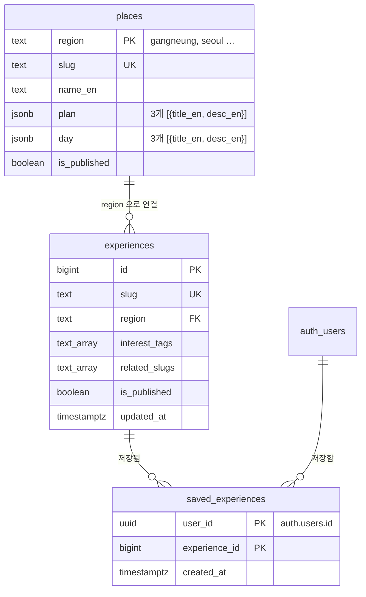

# Supabase 이전 계획 — 콘텐츠 DB · 선택 로그인 · 저장 동기화

작성일: 2026-09-23 · 버전: 1.1 · 관련 문서: `docs/plan/experience-korea-mvp-handoff.md` (v1.1 변경 이력 참고)

## 0. 한 줄 요약

**콘텐츠를 DB로 옮기고 → 이메일·비밀번호 로그인을 붙이고 → 저장 목록을 로그인한 사람만 DB에 저장한다.** 로그인은 선택 사항이며, 로그인하지 않은 사람은 지금처럼 이 기기(브라우저)에 저장한다.

## 1. 이번에 확정한 결정

| 결정 | 내용 |
|---|---|
| 로그인 여부 | **선택 사항.** 로그인하지 않아도 탐색·저장이 모두 된다. 로그인하면 저장 목록이 계정에 남아 다른 기기에서도 보인다. |
| 로그인 방식 | **이메일 + 비밀번호 한 가지.** 소셜 로그인·매직링크는 넣지 않는다. |
| 이메일 인증 | **Supabase에서 끈다** (Authentication → Sign In / Providers → Email → *Confirm email* 끔). 가입 즉시 로그인된다. |
| 저장 단위 | 기존대로 **경험만** 저장한다. 지역 저장은 넣지 않는다. |
| 콘텐츠 반영 시점 | **1시간마다 자동 반영 + 즉시 반영.** Supabase에서 경험·지역을 고치면 Database Webhook이 사이트의 캐시 비우기 주소를 불러 바로 반영된다. 웹훅이 실패해도 최대 1시간 뒤에는 반영된다. |
| 비밀번호 재설정 | **나중에.** 이메일 인증을 켤 때 함께 넣는다 (§6). |
| 범위 밖 유지 | Stories, 후기, AI 일정, 예약·결제, 자동 개인화는 이번 작업에 넣지 않는다. |

이 결정으로 인수인계 문서의 “회원 계정 및 기기 간 동기화는 초기 범위 밖” 항목이 바뀌었다. 바뀐 내용은 인수인계 문서 앞부분 **변경 이력**에 기록했다.

## 2. 지금 상태 (2026-09-23 확인)

| 영역 | 현재 | 파일 |
|---|---|---|
| 경험·지역 콘텐츠 | 코드 안 샘플 배열에서 읽음 (경험 10개, 지역 2곳) | `src/data/*.sample.ts` |
| 콘텐츠 읽기 함수 | “Supabase가 붙으면 이 파일만 바꾼다”는 전제로 한곳에 모여 있음 | `src/lib/experiences.ts`, `src/lib/places.ts` |
| 데이터 모양 | 칸 이름을 Supabase `experiences` 표 기준으로 이미 맞춰 둠 | `src/lib/types.ts` |
| 저장 목록 | localStorage `ek.saved.v1`에 경험 **slug** 배열 | `src/lib/useSaved.ts` |
| 저장 목록을 쓰는 곳 | 머리 숫자, 책갈피, 저장 버튼, 저장 페이지 — 모두 `useSaved()` 하나만 씀 | `Header.tsx`, `BookmarkButton.tsx`, `SaveButton.tsx`, `SavedList.tsx` |
| Supabase 연결 | 브라우저·서버 클라이언트와 세션 갱신(`proxy.ts`)까지 설정됨, 실제 사용처는 없음 | `src/lib/supabase/*`, `src/proxy.ts` |
| Supabase DB | `public` 스키마에 표 없음 | — |
| 페이지 생성 방식 | 경험·지역 상세가 `generateStaticParams`로 미리 만들어짐 | `experiences/[slug]/page.tsx`, `places/[slug]/page.tsx` |
| 안내 문구 | “계정을 요구하지 않고 이메일도 모으지 않는다”, “이 기기에 저장” | `src/messages/en.json` (`privacy`, `saved.device`) |

**좋은 점:** 콘텐츠 읽기는 `experiences.ts`·`places.ts` 두 파일에만 있고, 저장은 `useSaved()` 하나로만 쓰인다. 그래서 이 세 파일의 **안쪽만 바꾸면** 화면 부품은 거의 건드리지 않아도 된다.

## 3. 왜 이 순서인가

```
1단계 DB 설계·콘텐츠 이전  →  2단계 인증  →  3단계 저장 동기화  →  4단계 문구·마무리
```

- **DB가 먼저인 이유:** 저장 표는 “어느 사용자가 어느 경험을 저장했나”를 담는다. 경험 표가 먼저 있어야 저장이 그것을 가리킬 수 있다. 콘텐츠 이전은 로그인과 상관없이 모든 방문자에게 영향을 주고, 되돌리기도 쉽다.
- **인증이 저장보다 먼저인 이유:** 저장 동기화는 “지금 로그인했는가”에 따라 저장 위치가 바뀐다. 로그인 상태를 알 수 있어야 만들 수 있다.
- **문구가 마지막인 이유:** 개인정보 안내는 실제 동작이 확정된 뒤에 써야 사실과 어긋나지 않는다. 다만 **로그인을 공개하는 배포에는 반드시 함께 들어가야 한다** (4단계 참고).

각 단계는 브랜치 하나, PR 하나로 끝낸다. 한 단계가 끝나면 사이트는 그 상태로도 정상 동작해야 한다.

## 4. 데이터베이스 설계 초안

실제 SQL은 각 단계에서 `supabase-postgres-best-practices` 기준으로 작성한다. 여기서는 구조와 규칙만 정한다.

### 4.1 표 목록과 관계



(칸 전체 목록은 `src/lib/types.ts`의 `Experience`, `Place`를 그대로 따른다.)

### 4.2 표별 설계 메모

**`places` — 지역 안내**
- 기본 키는 `region`(text). 지금 코드가 경험과 지역을 `region` 값으로 잇고 있어서, 이 값을 그대로 키로 쓰면 코드를 바꿀 곳이 가장 적다.
- `plan`, `day`는 항상 3개씩 묶여 다니고 따로 검색할 일이 없으므로 `jsonb`로 둔다.
- 지금 `Region` 타입이 `"gangneung" | "seoul"`로 고정되어 있다. 지역이 DB에서 늘어나면 이 타입을 `string`으로 풀거나, 생성된 DB 타입을 쓰도록 바꾼다.

**`experiences` — 경험**
- 기본 키 `id`(bigint, 자동 증가), `slug`에는 unique를 건다. URL은 slug를 쓰고, 다른 표가 가리킬 때는 id를 쓴다 (slug는 바뀔 수 있으므로).
- `region`은 `places.region`을 가리키는 외래 키. 인덱스를 함께 만든다 (지역 상세·필터에서 자주 거른다).
- `duration`, `price_level`은 `check` 제약으로 허용 값을 제한한다 (`types.ts`의 값과 동일). `english_ease`, `localness`는 1–5 `check`.
- `interest_tags`, `style_tags`, `image_urls`, `image_captions`, `related_slugs`는 `text[]`. 초기 콘텐츠 규모(수십 개)에서는 별도 표로 쪼갤 이득이 없다.
- `updated_at`은 수정 시 자동으로 바뀌도록 트리거를 둔다.

**`saved_experiences` — 저장 목록 (로그인한 사람만)**
- 기본 키 `(user_id, experience_id)` — 같은 경험을 두 번 저장할 수 없다. 이 키가 “내 저장 목록 조회”용 인덱스 역할도 한다.
- `user_id` → `auth.users(id)` **on delete cascade**: 계정을 지우면 저장 목록도 지워진다.
- `experience_id` → `experiences(id)` **on delete cascade**. 비공개로 바뀐 경험은 행이 남지만 화면에서는 걸러진다 (인수인계 §9.2 “콘텐츠가 비공개·삭제됨” 처리).
- `created_at` = 인수인계 §11의 “저장 시점”.
- 사용자 프로필 표(`profiles`)는 만들지 않는다. 이메일은 Supabase 인증이 이미 보관하고, 지금 화면에 이름·사진을 보여줄 곳이 없다.

### 4.3 보안 규칙 (RLS)

모든 표에 RLS를 켠다.

| 표 | 누가 | 무엇을 |
|---|---|---|
| `places`, `experiences` | 누구나 (`anon`, `authenticated`) | `is_published = true`인 행만 **읽기** |
| `places`, `experiences` | 사이트에서는 아무도 | 쓰기 없음. 콘텐츠 수정은 Supabase 대시보드나 마이그레이션으로만 |
| `saved_experiences` | 로그인한 본인 (`authenticated`) | `user_id = (select auth.uid())`인 행만 읽기·추가·삭제. 수정(update)은 필요 없으므로 규칙을 만들지 않는다 |

- `auth.uid()`는 `(select auth.uid())`로 감싸 행마다 다시 계산하지 않게 한다.
- 비밀 키(`service_role`/secret key)는 사이트 코드에 쓰지 않는다. 지금 쓰는 공개 키(publishable key)와 RLS만으로 충분하다.
- 각 단계를 마친 뒤 Supabase advisors(보안·성능 점검)를 돌려 경고가 없는지 확인한다.

### 4.4 마이그레이션 관리

- 표 변경은 모두 SQL 파일로 저장소에 남긴다: `supabase/migrations/<시각>_<이름>.sql`.
- Supabase CLI는 설치되어 있지 않다 (2026-09-23 확인). 적용은 **Supabase MCP `apply_migration`**으로 하고, 같은 SQL을 위 경로에 파일로 저장한다. 파일과 실제 DB가 어긋나지 않도록 적용한 SQL을 그대로 복사한다.
- 샘플 콘텐츠는 별도 파일(`supabase/seed.sql` 또는 시드 마이그레이션)로 넣는다.
- 표를 바꿀 때마다 TypeScript 타입을 새로 만든다 → `src/lib/database.types.ts`.

## 5. 단계별 계획

### 1단계 — 콘텐츠 표 만들고 옮기기

**목표:** 사이트가 샘플 파일 대신 Supabase에서 경험·지역을 읽는다. 화면은 지금과 똑같아야 한다.

| 할 일 | 손대는 곳 |
|---|---|
| `places`, `experiences` 표 + RLS + 인덱스 마이그레이션 | `supabase/migrations/` |
| 샘플 10개 경험 · 2개 지역을 DB에 넣기 | 시드 SQL |
| DB 타입 생성 | `src/lib/database.types.ts` |
| 쿠키를 쓰지 않는 **공개 콘텐츠용 클라이언트** 추가 (아래 참고) | `src/lib/supabase/public.ts` (새 파일) |
| 읽기 함수를 DB 조회로 교체. 함수들이 `async`가 되므로 부르는 페이지에 `await` 추가 | `src/lib/experiences.ts`, `src/lib/places.ts`, 이를 쓰는 페이지들 |
| 샘플 파일은 시드가 끝나면 삭제 | `src/data/*.sample.ts` |
| Cache Components 켜기: `cacheComponents: true` | `next.config.ts` |
| 콘텐츠 읽기 함수에 `'use cache'` + `cacheLife('hours')` + `cacheTag('experiences')` / `cacheTag('places')` | `src/lib/experiences.ts`, `src/lib/places.ts` |
| 캐시 비우기 주소: `POST /api/revalidate` — 요청 헤더의 비밀 값이 `REVALIDATE_SECRET`과 같을 때만 `revalidateTag('experiences', 'max')`, `revalidateTag('places', 'max')` 실행. 다르면 401 | `src/app/api/revalidate/route.ts` (새 파일), `.env.local`, 배포 환경변수 |
| Supabase Database Webhook: `experiences`, `places` 표의 insert·update·delete 때 위 주소로 POST, 헤더에 비밀 값 | Supabase 대시보드 (Database → Webhooks). 배포 주소가 정해진 뒤 설정 |

**주의할 점**
- 콘텐츠는 로그인과 무관하므로 **쿠키를 읽지 않는** 클라이언트로 가져온다. 쿠키를 읽으면 페이지가 요청마다 새로 그려지는 방식으로 바뀌어, 지금의 미리 만들어 둔 페이지(`generateStaticParams`) 장점이 사라진다.
- 캐시는 이 버전의 기본 안내 방식(Cache Components)을 따른다. 작업 전 `node_modules/next/dist/docs/01-app/01-getting-started/08-caching.md`, `09-revalidating.md`, `02-guides/migrating-to-cache-components.md`를 먼저 읽는다. `cacheComponents`를 켜면 기존 페이지(`generateStaticParams`, `proxy.ts`, 쿠키를 쓰는 곳)의 동작이 바뀔 수 있으므로 **켜자마자 `pnpm build`로 먼저 확인**하고, 문제가 크면 이전 방식(`02-guides/caching-without-cache-components.md`)으로 바꾸고 그 이유를 이 문서에 적는다.
- `'use cache'` 안에서는 쿠키를 읽을 수 없다. 공개 콘텐츠용 클라이언트가 쿠키를 쓰지 않아야 하는 또 하나의 이유다.
- `revalidateTag`는 Route Handler에서 쓸 수 있고, `updateTag`는 Server Action 전용이다. 웹훅은 Route Handler로 받으므로 `revalidateTag(tag, 'max')`를 쓴다.
- `REVALIDATE_SECRET`은 `NEXT_PUBLIC_`을 붙이지 않는다 (브라우저에 노출 금지). 로컬 개발에서는 웹훅이 localhost에 닿지 않으므로 curl로 직접 불러 확인한다.
- `getRelatedExperiences`처럼 목록 전체를 여러 번 훑는 함수는 요청 한 번에 DB를 여러 번 부르지 않도록 정리한다.

**완료 기준**
- 메인·지역 상세·경험 목록·경험 상세·저장 페이지가 이전과 같은 내용으로 보인다.
- DB에서 경험 하나를 `is_published = false`로 바꾸고 `/api/revalidate`를 부르면 다음 요청부터 사이트에서 사라진다. 비밀 값 없이 부르면 401이 돌아온다.
- 배포 후: 대시보드에서 경험 문구를 고치면 웹훅을 거쳐 새로고침 한두 번 안에 바뀐다.
- `pnpm build`, `pnpm lint` 통과. Supabase advisors 경고 없음.

**진행 기록 (2026-09-23, 브랜치 `feat/supabase-content-db`)**
- Cache Components는 켠 채로 유지했다. 빌드를 막은 곳은 `/experiences`의 `?i=` 읽기 한 곳뿐이었고, 그 부분만 `<Suspense>`로 감쌌다 (기다리는 동안에는 전체 목록을 보여 준다).
- `Region` 타입은 `string`으로 풀었다. 지역 이름은 `places.name_en` 한 곳에서만 가져오고 `en.json`의 `region` 묶음은 지웠다. 대시보드에서 지역을 늘려도 코드를 고칠 필요가 없다.
- 지역 목록 순서는 `region` 값의 알파벳순, 경험은 `id` 순이다. 순서를 직접 정해야 하면 순서 칸을 따로 추가한다.
- DB에는 예전 실험에서 남은 `public.set_updated_at()`(SECURITY DEFINER)이 있었다. 마이그레이션에서 `create or replace`로 SECURITY INVOKER로 바꾸고 실행 권한을 거뒀다.
- 새 표에 RLS를 자동으로 켜는 이벤트 트리거 함수 `public.rls_auto_enable()`(Supabase 문서 예제로 설치됨)을 누구나 실행할 수 있어 advisors가 경고했다. 직접 불러도 바뀌는 것은 없음을 확인한 뒤, 경고를 없애려고 `public`·`anon`·`authenticated`의 실행 권한을 거뒀다. 새 표 RLS 자동 켜기는 그대로 동작한다. 이 함수는 저장소 마이그레이션이 아니라 대시보드에서 만들어졌으므로, 새 프로젝트에 마이그레이션을 다시 적용할 때는 이 함수가 먼저 있어야 한다.
- `revalidateTag(…, 'max')`는 비운 직후 첫 요청에는 이전 내용을 주고 그동안 새로 읽는다. 로컬에서 비공개 전환 → 캐시 비우기 → 수 초 안에 목록·지역 상세·경험 상세(404)에서 사라지는 것을 확인했다.
- **웹훅 설정 시 필요한 값:** `POST https://<배포 주소>/api/revalidate`, 헤더 `x-revalidate-secret: <REVALIDATE_SECRET>`. 배포 환경변수에 `REVALIDATE_SECRET`을 같은 값으로 넣어야 한다 (없으면 500).

### 2단계 — 이메일·비밀번호 로그인

**목표:** 원하는 사람만 가입·로그인·로그아웃할 수 있다. 로그인하지 않은 사람의 경험은 지금과 똑같다.

| 할 일 | 손대는 곳 |
|---|---|
| Supabase 설정: Email 제공자 켜기, *Confirm email* 끄기, 비밀번호 최소 길이 확인 | Supabase 대시보드 |
| 가입·로그인 화면 (한 페이지에서 전환하거나 두 페이지) | `src/app/[lang]/login/` 등 (새로 만듦) |
| 가입·로그인·로그아웃 처리 (Server Action) | 새 파일, 서버 클라이언트 `src/lib/supabase/server.ts` 사용 |
| 머리 영역에 로그인 / 로그아웃 진입점 | `src/components/layout/Header.tsx` |
| 화면 문구 | `src/messages/en.json` |

**주의할 점**
- 서버에서 로그인 여부를 판단할 때는 `getSession()`이 아니라 `getClaims()`를 쓴다 (`proxy.ts`에 이미 적용되어 있음).
- 로그인이 필요한 페이지는 없다. 로그인 페이지만 새로 생기고 기존 페이지는 막지 않는다.
- 로그인 후에는 원래 보던 페이지로 돌려보낸다 (탐색 흐름을 끊지 않기 — 인수인계 §3.2). 돌아갈 주소는 **사이트 안 경로만** 허용한다 (외부 주소로 튕기는 것 방지).
- 이메일 인증이 꺼져 있으므로 **남의 이메일로도 가입할 수 있다.** 이 위험과 비밀번호 재설정 문제는 §6에 정리했다.
- 화면은 디자인 시스템 문서(`docs/design-system/index.md`)를 먼저 읽고 기존 부품(`ButtonPrimary`, 입력칸 등)으로 만든다.

**완료 기준**
- 가입 → 바로 로그인됨 → 새로고침해도 유지 → 로그아웃됨.
- 틀린 비밀번호, 이미 가입된 이메일, 짧은 비밀번호에 대해 알아볼 수 있는 오류가 보인다.
- 로그인하지 않은 상태로 모든 기존 경로(인수인계 §3.3)가 그대로 된다.

### 3단계 — 저장 목록 연결 (DB + 기기 저장 병행)

**목표:** 로그인한 사람의 저장은 DB에, 로그인하지 않은 사람의 저장은 지금처럼 이 기기에 남는다. 화면 부품은 차이를 몰라도 된다.

| 할 일 | 손대는 곳 |
|---|---|
| `saved_experiences` 표 + RLS 마이그레이션, 타입 재생성 | `supabase/migrations/`, `database.types.ts` |
| `useSaved()` 안쪽을 “로그인 상태에 따라 저장 위치를 바꾸는” 구조로 교체. **밖으로 내보내는 모양(`slugs`, `toggle`, `remove`, `isSaved`)은 그대로 유지** | `src/lib/useSaved.ts` |
| 로그인 순간 기기 목록을 계정으로 합치기 | `useSaved.ts` 또는 별도 모듈 |
| 저장 실패 처리 (되돌리기 + 알림) | `useSaved.ts`, 저장 버튼 |

**동작 규칙 (기본값 — 바꾸려면 §7에서 결정)**

| 상황 | 동작 |
|---|---|
| 로그인 안 함 | 지금과 동일: localStorage `ek.saved.v1`에 slug 저장 |
| 로그인 함 | DB `saved_experiences`에 저장. 화면은 먼저 바꾸고(빠른 반응), DB 저장이 실패하면 **원래대로 되돌리고 실패를 알린다** (인수인계 §9.3 “실패를 성공으로 표시하지 않는다”) |
| 로그인하는 순간 | 기기 목록의 slug를 경험 id로 바꿔 DB에 추가 (이미 있는 것은 건너뜀). 성공하면 기기 목록을 비운다 |
| 로그아웃 | 기기 목록(병합 후 비어 있음)을 보여준다. 계정 목록은 기기에 남기지 않는다 — 같은 기기를 다른 사람이 쓸 수 있으므로 |
| 다른 탭에서 로그인·로그아웃 | 인증 상태 변화 이벤트를 듣고 목록을 다시 불러온다 |

- 저장 페이지(`SavedList.tsx`)의 “없는 경험 자동 정리”는 로그인 상태에서는 DB 행을 지우는 대신 **화면에서만 걸러낸다**. 경험이 다시 공개되면 목록에 돌아오게 하기 위해서다.
- slug는 화면에서 쓰는 값, id는 DB에서 쓰는 값이다. 바꾸는 일은 `useSaved` 안에서만 한다.

**완료 기준 (인수인계 §13 시나리오 2·6 포함)**
- 로그인 상태에서 목록·지역 상세·경험 상세 어디서 저장해도 머리 숫자, 책갈피, 저장 페이지가 일치한다.
- 다른 브라우저에서 같은 계정으로 로그인하면 같은 목록이 보인다.
- 로그인 전 저장한 3개가 로그인 후 계정 목록에 합쳐지고, 중복이 생기지 않는다.
- 네트워크를 끊고 저장을 누르면 성공으로 표시되지 않는다.
- 다른 계정으로 로그인하면 앞 계정의 목록이 보이지 않는다 (RLS 확인).

### 4단계 — 안내 문구·개인정보·마무리

**목표:** 화면의 설명이 실제 동작과 맞는다. **로그인 기능을 공개하는 배포에는 이 단계가 반드시 함께 들어가야 한다** (2·3단계만 먼저 배포하면 개인정보 페이지가 사실과 달라진다).

| 할 일 | 손대는 곳 |
|---|---|
| 개인정보 페이지: “계정을 요구하지 않고 이메일도 모으지 않는다”를 “계정은 선택이며, 만들면 이메일과 저장 목록을 보관한다” 취지로 수정 | `en.json` → `privacy` |
| 저장 페이지 안내: 로그인 여부에 따라 “이 기기에 저장” / “계정에 저장” 문구 전환. 로그인하지 않은 사람에게는 “로그인하면 다른 기기에서도 볼 수 있다”는 가벼운 안내 | `en.json` → `saved.device`, `saved/page.tsx` |
| 인수인계 §13 시나리오 전체 재확인 (로그인·비로그인 양쪽) | — |
| Supabase advisors 최종 점검 | — |

## 6. 이메일 인증을 끈 상태의 위험과 대응

| 위험 | 영향 | 지금의 대응 |
|---|---|---|
| 남의 이메일, 없는 이메일로 가입 가능 | 그 이메일 주인이 나중에 가입할 수 없음 | 초기 규모에서는 감수. 실제 사용자가 생기면 인증을 켜는 것을 다시 검토 |
| **비밀번호를 잊으면 복구하기 어려움** | 재설정 메일이 가긴 하지만, 주소가 확인된 적이 없어 본인이 받는다는 보장이 없음 | **확정: 첫 버전에는 재설정 기능을 넣지 않는다.** 이메일 인증을 켤 때 함께 넣는다. 그 전까지 문의로 처리 |
| Supabase 기본 메일 서버의 발송 한도가 낮음 | 재설정 메일 등이 막힐 수 있음 | 메일을 보내는 기능을 넣을 때 외부 메일 서버(SMTP) 연결을 함께 검토 |
| 가입 남용 (자동 가입) | 가짜 계정 누적 | Supabase 기본 속도 제한 유지. 문제가 보이면 캡차 추가 검토 |

저장 목록이라는 비교적 가벼운 데이터만 다루므로 위 위험은 초기에 감수할 수 있는 수준으로 본다. 개인 결제·예약 정보가 들어오기 전에는 반드시 이메일 인증을 켠다.

## 7. 아직 결정이 필요한 항목

(1·2단계를 막는 항목은 없다. 콘텐츠 반영 시점과 비밀번호 재설정은 2026-09-23 확정 → §1)

| 항목 | 선택지 | 권장 | 언제까지 |
|---|---|---|---|
| 계정 삭제 | 사이트 안 버튼 / 문의로 처리 | 초기에는 문의로 처리하고 개인정보 페이지에 방법 명시 | 4단계 전 |
| 로그인 후 기기 목록 처리 | 합친 뒤 비움(기본값) / 그대로 둠 | 비움 — 공용 기기에서 목록이 섞이지 않게 | 3단계 시작 전 |
| 저장 해제 실행 취소 | 넣음 / 안 넣음 | 인수인계 §9.2 권고에 따라 넣되, 3단계 범위를 넘으면 별도 작업으로 분리 | 3단계 중 |

## 8. 이 계획에서 하지 않는 것

- 소셜 로그인, 매직링크, 전화번호 로그인
- 관리자 화면 (콘텐츠 수정은 Supabase 대시보드로)
- 사용자 프로필(이름·사진), 알림·이메일 발송
- 지역 저장, Stories, 후기, 개인화 추천
- 사진 파일을 Supabase Storage로 옮기는 일 (사진 확보 방식이 정해진 뒤 별도 계획)
